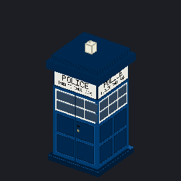

# TARDIS — a Project Zomboid build 42 mod

A working TARDIS for Project Zomboid **42.20.4**. Summon the police box onto
any free tile, step inside, and find a bigger-on-the-inside ship of six decks
descending from the console room to a hydroponics farm. Fly it from the
console using the world map or a saved bookmark.

Everything is generated at runtime — no TileZed map, no hand-authored art.
The meshes and textures are produced by scripts in `tools/`.



## What it does

| | |
| --- | --- |
| **Summon it** | Right-click any free tile, indoors or out, and materialise the box there. It works on bare grass and road, not just on interactable tiles. |
| **Enter and leave** | Right-click the box to step inside; right-click anywhere inside to step back out. |
| **Six decks** | Console room, habitation, stores, library, galley, hydroponics — each a 25×25 octagonal hall, one storey below the last, floating in black void. |
| **Infinite water** | Sinks, showers and toilets are refilled every ten in-game minutes. |
| **Stocked out** | Racks of tools and medicine; every volume of every skill book in the game; magazines and tapes; food, cookware and a pantry. |
| **An armoury** | Five packed crates in the console room, and a second bay with gun racks on the stores deck: every firearm the build ships, every magazine, every calibre of ammunition in every packaging, and the optics to go with them. |
| **A galley corner** | Sink, oven, microwave, fridges and stocked cabinets in the console room, so the deck you live on can feed you. |
| **A working farm** | Sown and plowed plots under grow lamps, seed stores, and livestock. |
| **Fly it** | The world map doubles as the flight console. Click a destination or pick a bookmark; the ship lands on the nearest open ground when you next step outside. |
| **No fog at the console** | The map is fully revealed while the flight console is open, so you can aim at somewhere you have never been. Your ordinary map keeps its fog. |
| **Bookmarks** | Save anywhere the ship has been and return to it later. |
| **A field at the doors** | Nothing dead gets within ten tiles of the box. They are shoved back, not killed — no free experience, no free loot. |

## Installing

```sh
sh tools/deploy.sh
```

Copies `TARDIS/` to `%UserProfile%\Zomboid\mods\TARDIS`. Enable **TARDIS** in
the Mods screen and in the mod list of the world you are playing.

## Playing

1. Right-click a clear tile → **Materialise the TARDIS here**.
2. Right-click the box → **Enter the TARDIS**.
3. Inside, right-click anywhere for the **TARDIS** menu: step outside, open the
   flight console, bookmark where the ship is, or move between decks.
4. In the flight console, click the map to choose a landing site or pick a
   saved bookmark. The ship arrives the next time you step outside — a distant
   destination is in a chunk the game has not loaded yet, so it lands once you
   are actually there.

Decks are joined through the menu rather than by walking. Each is its own
island in the void; see [DESIGN.md](DESIGN.md) for why.

## Layout

```
        z=5   [console]                                    Console Room
        z=4          [housing]                             Habitation Deck
        z=3                 [storage]                      Stores Deck
        z=2                        [library]               Library Deck
        z=1                               [galley]         Galley Deck
        z=0                                      [growing]  Hydroponics Deck
              |<-- 80 -->|
```

Each deck sits one z level below the last **and** 80 tiles east of it, so no
deck is ever directly above another. That is deliberate and load-bearing:
Project Zomboid draws every level above the player and only hides what is
overhead inside a real building, which runtime-generated squares cannot be.
Stacked, the top deck was drawn over all the rest.

The interior occupies cell 92,40 onward — clear of the vanilla map (which
ends at cell x 77) and of the Fifth-Wheel RV interior at cell 85,40.

## Repository layout

```
TARDIS/42/media/lua/shared/TARDIS/   config, helpers, translations
TARDIS/42/media/lua/client/TARDIS/   build, doors, menus, travel, self test
TARDIS/42/media/models_X/            police box and console meshes (.x)
TARDIS/42/media/textures/            generated textures
TARDIS/42/media/scripts/tardis.txt   item and model definitions
tools/                               asset generators and dev scripts
tests/                               static checks against the live game data
```

## Tools

| | |
| --- | --- |
| `tools/pzapi.py` | Prints real Java method signatures out of the game jar. The game ships no `javap`, and guessing at engine method names has broken this mod twice. |
| `tools/pzcatalog.py` | Builds and queries catalogues of every build 42 sprite and item id. |
| `tools/preview_model.py` | Software renderer for `.x` meshes — check a model without launching the game. |
| `tools/gen_*.py` | Generate the meshes, textures and inventory icon. |
| `tools/luacheck.py` | Parses every Lua file through a real Lua VM. |
| `tools/deploy.sh` | Copy the mod into the Zomboid mods folder. |
| `tools/readtest.sh` | Pull the mod's own lines out of `console.txt`. |

## Testing

Static checks, seconds each, no game required:

```sh
python tools/luacheck.py TARDIS/42/media/lua   # every Lua file parses
python tests/test_assets.py                    # every sprite name and item id
                                               # resolves against build 42 data
python tests/test_stock.py                     # loot spreads across its list
python tests/test_layout.py                    # floor plan + furniture offsets
```

In-game: launch with `-debug` and load a **fresh** world with the mod enabled.
The self-test runs itself a few seconds in and writes `TARDIS-TEST` lines to
`%UserProfile%\Zomboid\console.txt`. On a world where the ship is already in
use it stays out of the way; `TARDIS_SelfTest()` from the debug console forces
it.

It materialises the shell, boards it, then builds and inspects every deck in
turn — floors, walls, landing, container stocking, nothing overhead, void
margin — then water, crops, the repulsion field, exit and bookmarks.

```sh
sh tools/readtest.sh
```

## Changing it

See **[DESIGN.md](DESIGN.md)** for how the interior is laid out, how to
furnish a deck, add a deck, pick sprites and items, regenerate the models,
and the four engine constraints the whole design is shaped around.

Almost every change is an edit to `TARDIS_Config.lua` plus one `furnish`
function.

## Known limits

- **Single player.** Nothing is written for multiplayer; the build runs
  client-side and there is no server command path.
- **One ship.** The mod tracks a single box, so a second one is not supported.
- **Decks are joined by the menu**, not by walking between levels.
- **Moving a deck loses its container contents.** Rebuilds preserve furniture,
  stored items and crops; relocating a deck is a migration, not a rebuild.
- **Changing a loot list does not restock decks that already exist.** The ship
  is meant to be lived in, so a rebuild never refills a container. Use
  `TARDIS_Rebuild()` from the debug console, or a fresh world.
