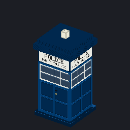

# TARDIS — a Project Zomboid build 42 mod

A working TARDIS for Project Zomboid **42.20.4**. Summon the police box onto
any free tile, step inside, and find a bigger-on-the-inside ship of six decks
descending from the console room to a hydroponic garden. Fly it from the
console using the world map or a saved bookmark.

The interior is built at runtime from generated data, in the mod's own tiles:
white roundel walls, the hexagonal console and its time rotor, the police box
doors seen from inside, walnut and brass, all in square-edged rooms. The art
was painted by Gemini, modelled by TRELLIS and cut to the game's grid by the
scripts in `tools/` -- see [INTERIOR.md](INTERIOR.md).



## What it does

| | |
| --- | --- |
| **Summon it** | Right-click any free tile, indoors or out, and materialise the box there. It works on bare grass and road, not just on interactable tiles. |
| **Enter and leave** | Right-click the box to step inside; right-click anywhere inside to step back out. |
| **Six decks** | Console room, habitation, stores, library, galley, gardens — each a set of square-walled rooms off a corridor or a hall, one storey below the last, floating in black void. |
| **The console room** | Roundel walls, the hexagonal console with its time rotor, the police box doors, the scanner, the Doctor's corner of books and leather chairs, an armoury and a galley corner through two doors. |
| **Somewhere to live** | Bedrooms, a dormitory, a Victorian bathroom, and the Wardrobe: racks of long coats and striped scarves round a spiral stair. |
| **A sonic screwdriver** | Three of them, in a glass case beside the police box doors. Carry one, right-click a locked door, gate, window or car and choose **Use sonic screwdriver** — a moment's work and the lock gives way: house doors, player-built doors and gates, padlocks, keypads, window latches, car doors and boots. |
| **Cars that start** | Used on a car, it also bypasses the ignition and puts a charge in a flat battery, so you can drive it away. It does not put fuel in the tank. |
| **Infinite water** | Sinks, basins, baths and troughs are refilled every ten in-game minutes. |
| **Stocked out** | A storeroom of tools, linen and medicine, an infirmary and a workshop; every volume of every skill book in the game, in a walnut library; records and tapes; a kitchen, a dining room and a pantry. |
| **The hold** | The console itself and six roundel lockers, a hundred apiece, packed with the ship's kit: medicine, tins, dry stores, sidearms and an M16 with its ammunition. |
| **An armoury** | Gun cabinets and trunks off the console room, and a second store of trunks on the stores deck: every firearm the build ships, every magazine, every calibre of ammunition in every packaging, and the optics to go with them. |
| **Its own power** | Every deck is powered whether or not the grid is still on: the fridges keep cold and the ranges cook. No generator, no fuel. |
| **A galley corner** | Sink, range, fridges and a dresser off the console room, so the deck you arrive on can feed you. |
| **A working garden** | Sown beds under grow lamps, seed cabinets and a potting bench, and a stable of livestock. |
| **Fly it** | The world map doubles as the flight console. Click a destination or pick a bookmark; the ship lands on the nearest open ground when you next step outside. |
| **No fog at the console** | The map is fully revealed while the flight console is open, so you can aim at somewhere you have never been. Your ordinary map keeps its fog. |
| **Bookmarks** | Save anywhere the ship has been and return to it later. |
| **A field at the doors** | Nothing dead gets within ten tiles of the box. They are shoved back, not killed — no free experience, no free loot. |

## Installing

```sh
sh tools/deploy.sh
```

Copies `TARDIS/` to `%UserProfile%\Zomboid\mods\TARDISDev` as **TARDIS [DEV]**,
so a local build can be chosen instead of the Workshop release. Enable one of
the two -- never both -- in the Mods screen and in the world's mod list.

## Playing

1. Right-click a clear tile → **Materialise the TARDIS here**.
2. Right-click the box → **Enter the TARDIS**.
3. Inside, right-click anywhere for the **TARDIS** menu: step outside, open the
   flight console, bookmark where the ship is, or move between decks. The
   police box doors in the console room's north wall are where you arrive.
4. In the flight console, click the map to choose a landing site or pick a
   saved bookmark. The ship arrives the next time you step outside — a distant
   destination is in a chunk the game has not loaded yet, so it lands once you
   are actually there.
5. Take a **sonic screwdriver** from the case beside the console before you
   go. With it anywhere on you — pockets, bag, anywhere — right-click a
   locked door, gate or window for **Use sonic screwdriver on the lock**, or a
   car for **Use sonic screwdriver on the vehicle**. The character walks over
   if needed and works at it for a moment; walking away cancels it. A car
   comes out unlocked, hotwired and with a charged battery.

Decks are joined through the menu rather than by walking. Each is its own
island in the void; see [DESIGN.md](DESIGN.md) for why.

## Layout

```
        z=5   [console]                                    Console Room
        z=4          [housing]                             Habitation Deck
        z=3                 [storage]                      Stores Deck
        z=2                        [library]               Library Deck
        z=1                               [galley]         Galley Deck
        z=0                                      [growing]  Gardens
              |<-- 80 -->|
```

Each deck sits one z level below the last **and** 80 tiles east of it, so no
deck is ever directly above another. That is deliberate and load-bearing:
Project Zomboid draws every level above the player and only hides what is
overhead inside a real building, which runtime-generated squares cannot be.
Stacked, the top deck was drawn over all the rest.

The interior occupies cell 92,40 onward — clear of the vanilla map (which
ends at cell x 77) and of the Fifth-Wheel RV interior at cell 85,40.

## Repository layout

```
TARDIS/42/media/lua/shared/TARDIS/   config, the generated layout, helpers, translations
TARDIS/42/media/lua/client/TARDIS/   build, doors, menus, travel, sonic, self test
TARDIS/42/media/texturepacks/        the interior's tiles (generated)
TARDIS/42/media/tardis_interior.tiles  their properties (generated)
TARDIS/common/media/seating.txt      where you sit on them (generated)
TARDIS/42/media/models_X/            police box and old console meshes (.x)
TARDIS/42/media/textures/            generated textures
TARDIS/42/media/scripts/tardis.txt   item and model definitions
design/                              Gemini art, tile sheets, BuildingEd decks, renders
tools/                               the art pipeline, asset generators and dev scripts
tests/                               static checks against the live game data
```

## Tools

| | |
| --- | --- |
| `tools/pzapi.py` | Prints real Java method signatures out of the game jar. The game ships no `javap`, and guessing at engine method names has broken this mod twice. |
| `tools/pzcatalog.py` | Builds and queries catalogues of every build 42 sprite and item id. |
| `tools/preview_model.py` | Software renderer for `.x` meshes — check a model without launching the game. |
| `tools/gen_tardis_*.py` | The interior pipeline: structure tiles, furniture tiles, decks, texture pack, layout. See [INTERIOR.md](INTERIOR.md). |
| `tools/tardis_objects.py`, `tools/tardis_jobs.py` | Every piece of furniture, and the ledger of its Gemini concept and TRELLIS mesh. |
| `tools/isorender.py` | Renders a mesh straight into the game's 2x iso tiles. |
| `tools/install_tilezed.py` | Puts the tilesets into TileZed and BuildingEd. |
| `tools/gen_*.py` | Generate the police box and sonic meshes, textures and icons. |
| `tools/luacheck.py` | Parses every Lua file through a real Lua VM. |
| `tools/deploy.sh` | Copy the mod into the Zomboid mods folder. |
| `tools/readtest.sh` | Pull the mod's own lines out of `console.txt`. |

## Testing

Static checks, seconds each, no game required:

```sh
python tools/luacheck.py TARDIS/42/media/lua   # every Lua file parses
python tests/test_assets.py                    # every sprite name and item id
                                               # resolves against build 42 data
python tests/test_stock.py                     # loot spreads across its list
python tests/test_layout.py                    # every deck, printed and checked
python tests/test_build.py                     # the builder against a stub engine
```

In-game: launch with `-debug` and load a **fresh** world with the mod enabled.
The self-test runs itself a few seconds in and writes `TARDIS-TEST` lines to
`%UserProfile%\Zomboid\console.txt`. On a world where the ship is already in
use it stays out of the way; `TARDIS_SelfTest()` from the debug console forces
it.

It materialises the shell, boards it, then builds and inspects every deck in
turn — every layout object read back, floors, landing, container stocking,
nothing overhead, void margin — then the hold, the sonic case, the galley,
water, crops, the repulsion field, exit and bookmarks.

```sh
sh tools/readtest.sh
```

## Changing it

- **[INTERIOR.md](INTERIOR.md)** — how the interior's art and decks are made:
  Gemini, TRELLIS, the tile generators, BuildingEd, and how the game builds it.
- **[DESIGN.md](DESIGN.md)** — how the interior is laid out: moving furniture,
  stocking, adding a deck, tiles and items, and the four engine constraints the
  whole design is shaped around.
- **[DEV_GUIDE.md](DEV_GUIDE.md)** — how to work on the project: the build
  loop, the rules that exist because they were broken, failure signatures and
  what they actually mean, and how to test.

Almost every change is an edit to a deck in BuildingEd and a regenerated
layout, plus perhaps a stock rule in `TARDIS_Config.lua`.

## Known limits

- **Single player.** Nothing is written for multiplayer; the build runs
  client-side and there is no server command path.
- **One ship.** The mod tracks a single box, so a second one is not supported.
- **Decks are joined by the menu**, not by walking between levels.
- **A world from before 2.0.0 is refitted, not rebuilt.** Each old deck is
  cleared the first time you visit it and the new one put down; what was in
  the old shelves goes into the new ones, and what does not fit is left in a
  heap by the landing. A fresh world is the clean way to see the new ship.
- **Power needs `AllowExteriorGenerator`** (on by default). The ship powers
  itself the way a generator would, and the engine treats the decks as
  outdoors, so with that sandbox option off the decks stay dark.
- **It may rain inside.** The decks are runtime-built, so the engine does not
  count them as a building. (The Shuttlecraft's roof fix has not been carried
  across yet.)
- **Changing a loot list does not restock decks that already exist.** The ship
  is meant to be lived in, so a rebuild never refills a container. Use
  `TARDIS_Rebuild()` from the debug console, or a fresh world.
- **The sonic screwdriver does not re-lock anything.** A lock it has opened
  stays open. (The old behaviour -- every lock within fifteen tiles opening
  on its own as you walk past -- is still there as `C.SonicAuto` in
  `TARDIS_Config.lua`, off by default.)
- **The sonic screwdriver does not fuel a car.** It unlocks it, bypasses the
  ignition and charges a flat battery, but an empty tank stays empty, and a
  car with no battery fitted has nothing to charge. Windows that a map has
  nailed permanently shut are left alone too — that is not a lock.
- **Hotwiring and jump-starting can be turned off** independently, with
  `C.SonicHotwire` and `C.SonicJumpStart` in `TARDIS_Config.lua`, if you would
  rather the screwdriver only opened doors.
